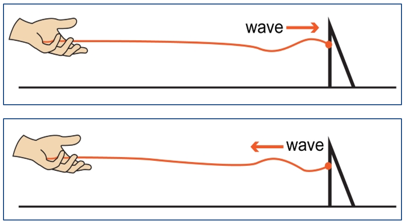
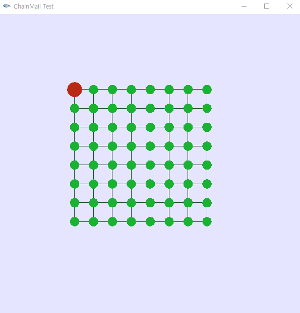
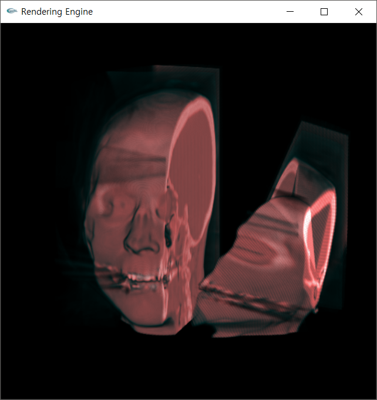

 This work is licensed under a <a rel="license" href="http://creativecommons.org/licenses/by-nc-nd/4.0/">Creative Commons Attribution-NonCommercial-NoDerivatives 4.0 International License</a>.

# Chainmail

현대 컴퓨터 하드웨어 성능이 발전해감에 따라, 가상 수술에 대한 연구와 적용이 활발히 진행되고 있습니다. 가상 수술을 시각화 하는 방식으로는 크게, 객체의 표면(surface)만을 그려내는 폴리곤 렌더링 방식과, 내부까지 모두 렌더링하는 볼륨 렌더링 방식[1]이 있습니다. 

폴리곤 렌더링 방식은 컴퓨터 그래픽스 분야에 있어 전통적인 기술입니다. 그러나, 이를 가상 수술의 시각화에 사용하는 것은 다소 무리가 있습니다. 만약 인체의 피부를 절개하여 피하조직을 보여줘야 하거나, 종양을 들어내는 작업이 수행된다고 생각해 보세요. 수술 절단면을 메시로 재구축하고, 인체 내부를 표현하기 위해 새로운 정점(vertex)과 메터리얼을 생성하는 작업을 실시간으로 처리한다는 것은 매우 어려울 것입니다. 

이와 같은 문제를 극복하기 위해, 볼륨 데이터 기반의 조작과 렌더링 방식을 채택하는 것은 좋은 전략입니다. 볼륨은 3차원 텍스처입니다. 엄밀히 말하면 CT, MRI와 같이 2차원의 단면 영상을 연속적으로 촬영한 것을 3차원으로 재구성한 것입니다. 볼륨으로 구성된 객체는 마치 푸딩과 같아서, 표면뿐 아니라 내부도 데이터가 모두 채워져 있습니다. 따라서 볼륨 구조의 인체를 절개하면 그 내부가 자연스레 드러나게 됩니다. 또한 촬영 영상을 그대로 자료구조화 하기 때문에, 폴리곤 렌더링 방식과 달리 아티팩트를 유발하는 메시 근사 과정이 존재하지 않아 렌더링 정확도가 높습니다. 

그러나 볼륨 데이터는 적게는 수 천만, 많게는 수 억의 복셀(voxel)들로 구성되어 있기 때문에 보편적인 알고리즘으로는 대화적 환경을 이끌어낼 수 없습니다. 이것이 바로 체인메일 알고리즘을 연구하게 된 이유입니다. 체인메일 알고리즘의 첫 번째 아이디어는 1997년, S.F. Gibson에 의해 제안되었습니다[2]. 체인메일 알고리즘은 기하학적인 특성을 가진 거동 모델입니다. 유한요소 모델링(FEM)이나 질량-스프링 모델[3]과 같은 물리 기반 모델은 사실적인 조작을 묘사할 순 있겠지만, 볼륨 데이터와 같은 대용량 자료구조에 이를 적용하는 것은 처리 속도가 느리기 때문에 사실상 불가능합니다. 대신 체인메일 알고리즘은 약간의 눈속임(기하학적 특성을 이용)을 통해 훨씬 뛰어난 퍼포먼스를 보여주게 됩니다. 

체인메일 알고리즘은 강체(뼈), 탄성체(연골, 피부) 등의 다양한 메터리얼을 표현할 수 있으며, 근육과 같은 비대칭 메터리얼도 구현이 가능합니다(근육은 축에 따라 메터리얼이 다릅니다). 체인메일 알고리즘의 기본 아이디어는 다음과 같습니다. 
먼저, 최초에 조작이 가해진 복셀은 위치를 이동한 후 이웃 복셀과 거리를 확인합니다. 
만약,

- 이웃 복셀과의 거리가 거리 최대값보다 길다면 &#10140; 이웃 복셀을 당깁니다.
- 이웃 복셀과의 거리가 거리 최소값보다 짧다면 &#10140; 이웃 복셀을 밀어냅니다.

위 과정을 통해 이웃 복셀이 움직이게 되면, 위 과정을 계속하여 반복합니다. 이는 잔잔한 호수면에 돌을 던지듯이, 최초 조작점으로부터 인근 복셀로 위치 이동이 퍼져나가게 됩니다. 이후 이웃간의 거리가 거리 상하한을 넘지 않거나, 전체 복셀에 이동이 전파된 경우 이동이 종료됩니다. 

여기서 거리 상하한을 조정하면 강체와 연체 모두 구현이 가능합니다.  
다음의 그림들은 이러한 알고리즘을 도식화한 것입니다.

<table>
  <tr>
    <td></td>
    <td></td>
  </tr>
  <tr>
    <td>
      <b>그림 1</b> 
      체인메일 알고리즘을 1차원 상에서 도식한 것입니다.
      현재 선택한 복셀이 우측으로 dx만큼 이동함에 따라 인근 이웃 복셀이 밀리거나 끌려가고 있습니다.
    </td>
    <td>
      <b>그림 2</b> 
      2차원 상에서 체인메일 알고리즘이 작동하는 과정입니다.
    </td>
  </tr>
</table>

구체적인 알고리즘은 다음과 같습니다.

1. 우선, 사용자가 선택한 복셀이 움직입니다.
2. 움직인 복셀은 Sponsor가 됩니다.
3. Sponsor는 자신의 4개 이웃 Candidates를 각각의 방향에 맞는 큐에 넣습니다.
    - 우측 Candidate &#10140; Right Queue, 좌측 Candidate &#10140; Left Queue, …
    - 우, 좌, 상, 하 순으로 Candidates를 처리합니다.
4. Right Queue에서 하나의 Candidate를 꺼냅니다.
5. 꺼낸 Candidate의 위치와 Candidate의 Sponsor 위치 차를 이용해 거리를 체크합니다.
    - Candidate의 이동 여부는 오직 Sponsor의 비교에 의해서만 판별됩니다.
    - 거리가 거리 상하한 범위 내에 있다면 해당 Candidate의 이동 전파는 종료됩니다.
    - 거리 상하한을 벗어난 값이라면, 상하한 값을 만족 시키는 최소한의 값으로 위치를 재조정합니다.
    - 예로, 우측 Candidate의 처리 방식은 아래와 같습니다.
      
6. Candidate의 위치가 조정되었다면, 해당 Candidate는 다시 Sponsor가 됩니다.
    - 위치가 조정된 Candidate의 4개 이웃을 다시 각각 방향에 맞는 큐에 넣습니다.
    - 다만 Candidate는 자신의 Sponsor를 Candidate로 둘 수 없습니다.
        - 예로, 우측 Candidate는 좌측 이웃을 Candidate로 둘 수 없습니다.
        - 우측 Candidate는 항상 좌측이 Sponsor이기 때문입니다.
        - 우측 Candidate: Right, Top, Bottom Candidate를 큐에 넣음
        - 좌측 Candidate: Left, Top, Bottom Candidate를 큐에 넣음
        - 상단 Candidate: Top Candidate를 큐에 넣음
        - 하단 Candidate: Bottom Candidate를 큐에 넣음
7. Right Queue에 저장된 Candidate가 하나도 없을 때까지 앞선 작업들을 반복합니다.
8. 이후 Left, Top, Bottom의 순서대로 나머지 Queue를 모두 처리합니다.

아래는 이러한 알고리즘을 기반으로 한 데모 영상입니다.

<kbd></kbd>

그러나 기존의 체인메일 알고리즘은 몇 가지 한계점이 있습니다. 첫 번째는 하나의 객체에 다양한 메터리얼을 부여할 수 없다는 것입니다. 알고리즘 자체가 한 객체에 한 메터리얼만 부여할 수 있도록 설계되어 있습니다. 이로 인해 뼈와 피부가 공존하는 객체를 구현할 수 없게 됩니다. 

두 번째는 객체 내부에 링크가 끊어진 곳이 있으면 비정상적으로 작동하는 것입니다. 이 또한 애초에 객체가 복잡한 토폴로지(topology, 위상)를 가지지 않을 것이라는 가정하에 알고리즘이 설계되었기 때문이며, 이러한 한계점으로 인하여 객체의 절개 연산이 불가능하게 됩니다. 다음은 이러한 한계점들을 시각적으로 표현한 영상입니다. 

<table>
  <tr>
    <td width="50%"></td>
    <td></td>
  </tr>
  <tr>
    <td>
      <b>그림 3</b>  
      2개 이상의 메터리얼을 가지는 물체의 조작을 3D ChainMail로 구현한 경우입니다. 
      초록색은 연체, 남색은 강체, 그리고 빨간색은 현재 사용자가 선택한 복셀을 표시한 것입니다. 
      복셀 간에 거리가 비정상적으로 늘어나거나, 서로 겹쳐지는 등의 현상이 나타나고 있습니다.
    </td>
    <td>
      <b>그림 4</b>  
      복잡한 토폴로지를 가지는 물체의 조작을 기존의 체인메일 알고리즘으로 수행한 경우입니다. 
      연결이 끊어진 부분을 중심으로 비정상적인 움직임이 나타나고 있습니다.
    </td>
  </tr>
</table>

이러한 문제점을 해결하기 위하여, 저는 기존 체인메일 알고리즘의 복셀 순회 순서를 개선하였습니다. 
원래의 경우 최초 조작점을 기준으로 이동의 전파가 우, 좌, 상, 하 순으로 고정되어 진행되지만,  
새로이 제안하는 방법은 파동의 전파 원리인 “호이겐스의 원리”에 따라 전파될 수 있도록 합니다.

<table>
  <tr>
    <td></td>
  </tr>
  <tr>
    <td>
      <b>그림 5</b>  
      호이겐스의 원리.  
      근원지로부터 생겨난 파원은 새로운 파면을 만들어냅니다. 이와 같은 과정은 재귀적으로 수행됩니다.
    </td>
  </tr>
</table>

볼륨 데이터를 일반화하면, 격자 형태로 배치된 그래프(graph)로 바라볼 수도 있습니다. 이러한 관점에서 호이겐스의 원리를 적용한다면 이는 BFS 알고리즘과 매우 흡사합니다. 따라서 저는 BFS 알고리즘의 개념을 차용하여 이동 전파 알고리즘을 개발했습니다. 변경되는 이동 전파 알고리즘은 구체적으로 다음과 같이 진행됩니다.

1. 기존 알고리즘에선 이동의 전파를 위해 4개의 candidate Queue를 사용하였으나, 
   새로운 알고리즘에서는 sponsor들을 저장할 1개의 큐(이하 sponsorQueue)를 사용합니다.
2. 최초에 움직인 복셀을 sponsorQueue에 넣습니다.
3. 큐에서 복셀을 하나 꺼낸 뒤, 해당 복셀(이하 sponsor)의 이웃을 조사합니다.
4. sponsor의 이웃 중 거리 제한 값을 벗어나는 이웃은 제한 값을 만족하도록 위치를 최소한으로 변경합니다.
5. 위치가 변경 된 이웃은 sponsorQueue에 넣습니다.
6. 3~5를 큐가 빌 때까지 반복합니다.

변경된 이동 전파 알고리즘은 호이겐스의 원리에 따라 이동의 전파가 회절하여 그 어떤 임의의 토폴로지에서도 이동의 전파가 성공적으로 수행됩니다.

<table>
  <tr>
    <td></td>
  </tr>
  <tr>
    <td>
      <b>그림 6</b>  
      복잡한 토폴로지를 가지는 객체 상에서 이동이 전파되는 과정.
    </td>
  </tr>
</table>

그러나 새로운 알고리즘을 적용하는 과정에서 한 가지 문제점이 발견되었습니다. 최초로 움직이는 복셀은 사용자가 지시한 만큼(∆𝑑𝑖𝑠𝑡𝑎𝑛𝑐𝑒)만 정확히 움직여야 합니다. 그러나 전파된 이동이 다시 최초 조작점으로 되돌아오면서, 외력 벡터의 반대 방향으로 간섭이 발생하였습니다. 결과적으로 무언가에 막히는 듯한 느낌으로 움직이게 되었습니다. 사실 수중에서 파동을 발생시킨 파원도 호이겐스 원리에 의해 파동을 다시 전달받게 되는 것처럼, 물리적인 관점에서 바라보았을 때 자연스러운 현상이긴 하지만 사용자가 원하는 현상은 아닐 것입니다. 

이러한 문제점을 해결하기 위해, 저는 최초 조작점으로 되돌아오는 이동 전파에 한하여 그 값을 그대로 반사하는 전략을 취하였습니다. 

<table>
  <tr>
    <td></td>
  </tr>
  <tr>
    <td>
      <b>그림 7</b>  
      고정된 물체로 전파된 파동은 파원으로 되돌아갑니다.
    </td>
  </tr>
</table>

다음은 앞선 이슈를 모두 해결한 모델의 데모 영상입니다.

<kbd></kbd>

여기까지의 알고리즘은 복잡한 메터리얼과 토폴로지를 잘 표현해 주었습니다. 하지만, 탄성이 구현되지 않아 객체가 완전히 plastic한 움직임을 보여주고 있습니다. 실제 인체를 구성하는 대부분의 조직은 탄성을 가지므로, 현재까지 구현한 알고리즘을 적용할 경우 사용자는 괴리감을 느낄 수 있습니다. 따라서 조작 연산 수행 시 메터리얼에 따른 탄성도 구현이 되어야 합니다. 

ChainMail 알고리즘의 개발자 S.F. Gibson의 말에 의하면, 물체의 변형을 가한 직후엔 System energy가 높은 상태라고 합니다. 따라서 System은 energy가 가장 낮아지는 방향으로 복셀들을 재정렬하게 되며, 이 과정을 Elastic Relaxation이라고 부릅니다.

<table>
  <tr>
    <td></td>
  </tr>
  <tr>
    <td>
      <b>그림 8</b>  
      시스템 에너지를 나타낸 그림. 
      (a)는 시스템의 에너지가 높은 상태이고, (b)는 시스템의 에너지가 가장 낮아진 상태입니다.
    </td>
  </tr>
</table>

Gibson은 Relaxation에 대한 설명과 함께 다음과 같은 알고리즘을 제시하였습니다.

<table>
  <td>
     
    전체 System energy가 가장 낮아질 때 까지 위 작업을 반복
  </td>
</table>

위 의사 코드에서 표현하는 “lowest energy position”은 다음과 같은 공식으로 계산하게 됩니다.

<table>
  <td>
     
    (x, y)opt: 현재 검사 중인 element의 최적 위치 
     xn, yn : 현재 검사 중인 element의 n번째 이웃의 좌표 
     ∆x, ∆y : 변형을 가하기 전 최초 상태에서의 이웃과의 거리 (보통 1)
  </td>
</table>

그러나 위 알고리즘에는 문제가 있습니다. 만약 이것을 그대로 사용한다면, 객체가 변형이 가해지기 전 상태로 되돌아갈 때까지 알고리즘은 종료되지 않습니다. 다시 말해, 모든 객체를 100% 탄성체로 간주하게 됩니다. 따라서 탄성의 정도를 조절하기 위해선 복셀이 lowest energy position과 어느 정도 가까워졌을 때 정렬을 멈추어야 합니다. 
구체적으로, 𝑒𝑙𝑒𝑚𝑃𝑜𝑠 −𝑜𝑝𝑡𝑃𝑜𝑠=𝑑𝑖𝑠𝑡일 때, 𝑑𝑖𝑠𝑡<𝑘를 만족 시 정렬을 중지하여야 합니다. 
이때의 k가 객체의 탄성 정도를 조절하는 값으로 활용됩니다. 

이러한 relaxation 알고리즘은 이동 전파 알고리즘을 수행한 뒤 연이어 수행합니다. 

다음은 탄성 연산을 추가한 알고리즘의 데모 영상입니다. 

  <kbd></kbd>
  <kbd></kbd>
  <kbd></kbd>

지금까지의 데모 영상은 2차원 환경에서 수행되었습니다. 
본 레포지토리 상에 업로드 되어 있는 코드는 실제 볼륨 데이터에 적용 가능한 3차원 체인메일 알고리즘입니다. 
시각화를 위한 그래픽스 프레임워크는 Direct3D 9를 사용하였습니다. 
다음은 3차원 환경에서의 데모 영상입니다.

<kbd></kbd>

다음은 실제 CT 영상으로부터 얻은 볼륨 데이터를 체인메일 알고리즘을 이용하여 조작한 영상입니다. 

  <kbd></kbd>
  <kbd></kbd> 
  <kbd></kbd>
  <kbd></kbd>

> 레퍼런스 
[1] L. Marc, “Display of Surfaces from Volume Data,” IEEE Computer Graphics and Applications, Vol. 8, No. 3, pp. 29-37, 1988. 
[2]	S.F. Gibson, “3D Chainmail: A Fast Algorithm for Deforming Volumetric Objects,” Proceeding of Symposium on Interactive 3D Graphics, pp. 149, 1997. 
[3]	P. Xavier, “Deformation Constraints in a Mass- Spring Model to Describe Rigid Cloth Behaviour,” Proceedings of Graphics Interface, pp. 147-154, 1995.
